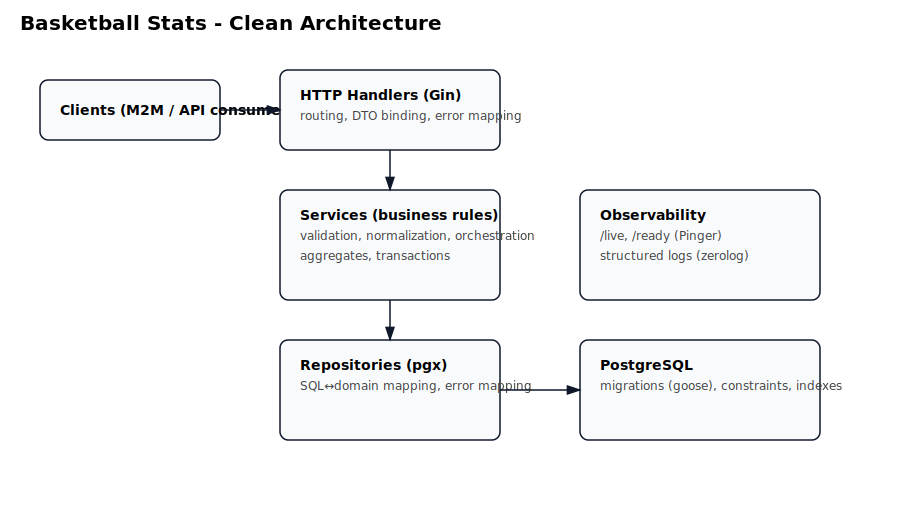
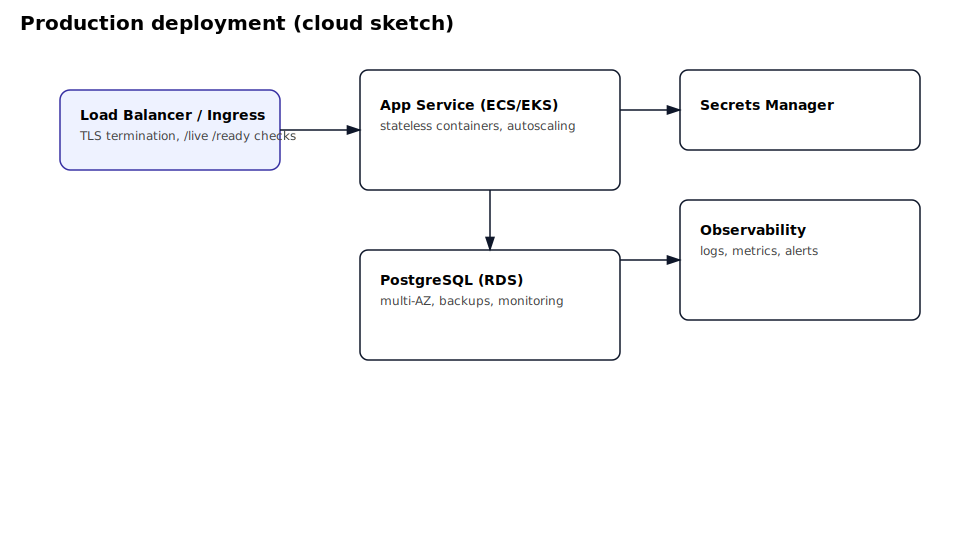

# Basketball Stats Service (Go + Postgres)

A production-grade, containerized service for logging NBA player statistics and serving up-to-date aggregates. Built in Go with clean architecture and a focus on validation, reliability, and developer ergonomics.



## Highlights
- Clean architecture: Handlers → Services → Repositories → Postgres.
- Strong validation in the service layer; consistent HTTP error mapping.
- Up-to-date aggregates for players and teams (career or seasonal).
- Containerized with Docker; one-command local stack via Docker Compose.
- OpenAPI spec + Swagger UI at runtime.
- CI pipeline with linting, migrations, and tests (including repository contracts).

## Quick start
Prerequisites: Go 1.25+, Docker, Docker Compose.

1) Start Postgres via Docker Compose:
```bash
make docker-up
```
2) Apply DB migrations:
```bash
make migrate-up
```
3) Run the service:
```bash
make run
```
4) Open docs:
- Swagger UI: http://localhost:8080/docs
- OpenAPI spec: http://localhost:8080/openapi.yaml

Health:
```bash
curl -s http://localhost:8080/ready | jq
```

## API overview
Base path: /api/v1

- Health:
  - GET /health/live
  - GET /health/ready
- Teams:
  - POST /teams
  - GET /teams
  - GET /teams/{team_id}
  - GET /teams/{team_id}/aggregates (alias: /teams/{team_id}/stats/aggregate)
- Players:
  - POST /players
  - GET /players
  - GET /players/{player_id}
  - GET /players/{player_id}/aggregates (alias: /players/{player_id}/stats/aggregate)
- Games:
  - POST /games
  - GET /games
  - GET /games/{game_id}
  - GET /games/{game_id}/stats
- Stats:
  - POST /stats
  - GET /stats
  - GET /stats/{stat_id}

Examples (aggregates):
```bash
curl -s "http://localhost:8080/api/v1/players/1/aggregates?career=true" | jq
curl -s "http://localhost:8080/api/v1/players/1/aggregates?season=2023-24" | jq
curl -s "http://localhost:8080/api/v1/teams/1/aggregates?season=2023-24" | jq
```

## Validation & errors
The service normalizes and validates input before hitting the DB. Key rules:
- Strings: trim and normalize case (enums to canonical set).
- Pagination: default limit=50; clamp to [1..100]; offset>=0.
- Stats constraints: integers ≥ 0, Fouls ∈ [0..6], Minutes Played ∈ [0..48.0].
- Player and Game existence verified before writes.

HTTP error mapping (pkg/response):
- 400 invalid_input (+ field_errors array)
- 404 not_found
- 409 already_exists/conflict
- 500 internal_error

## Development
- Tests (aggregated coverage):
```bash
make test
```
- Contract tests (require Postgres):
```bash
make test-contract
```
- Lint & vet:
```bash
make ci
```

## Configuration
Configuration is loaded from config.yaml and can be overridden by env vars.
- App port: APP_PORT
- DB connection: APP_POSTGRES_HOST, APP_POSTGRES_PORT, APP_POSTGRES_USER, APP_POSTGRES_PASSWORD, APP_POSTGRES_DB, APP_POSTGRES_SSLMODE

See .env.example for a starter set.

## Architecture & deployment
- System architecture: docs/ARCHITECTURE.md
- Cloud deployment sketch (AWS/GCP/Azure): docs/DEPLOYMENT.md



In short: the service runs as a stateless container behind a load balancer and talks to Postgres. Horizontal scaling is straightforward; repository layer is designed for contract testing and future persistence adapters.

## Why this design
- Separation of concerns keeps handlers thin and services focused on business rules.
- Repository contracts with error mapping to domain errors decouple higher layers from SQL/pg errors.
- Strong validation provides clear 400s to clients and reduces unnecessary DB traffic.
- Tests focus on contracts and core logic to enable safe refactors.

## License
MIT
